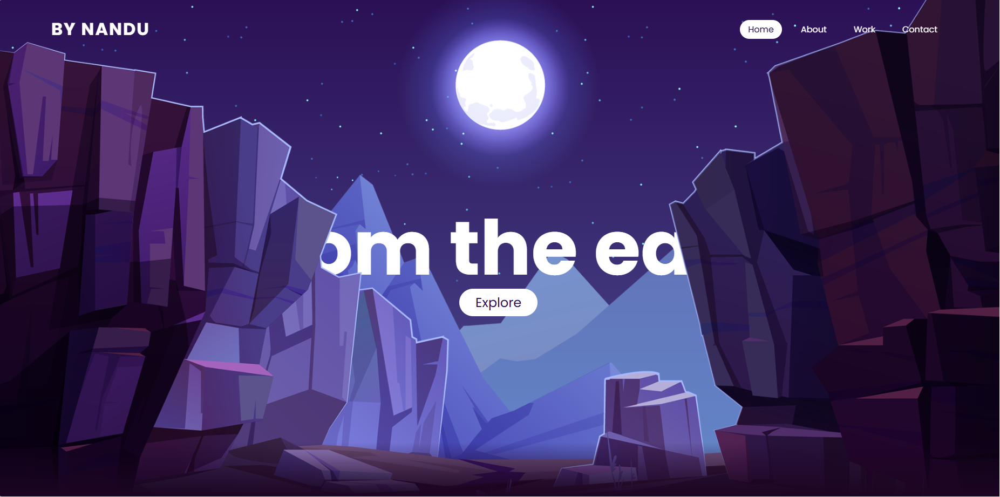
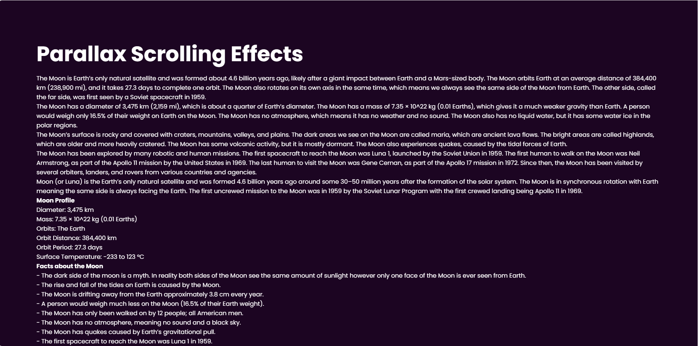
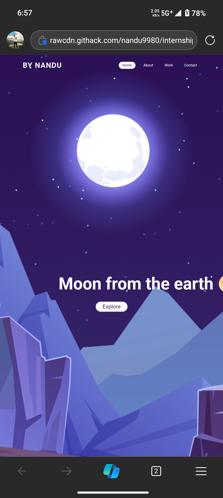

# Responsive Parallax Moon Website

This project is a simple responsive webpage developed using HTML, CSS, and JavaScript, designed to adapt seamlessly across desktop, tablet, and mobile screen sizes. It features a parallax scrolling effect with layered images and educational content about the Moon.

## Features
- **Parallax Scrolling**: Background images (stars, moon, mountains) move at different speeds on scroll, creating a depth effect.

## Setup
 1. **download the Repository**:
  open the html file in your browser to view the website.

## Screenshots
  
  
  
  
  