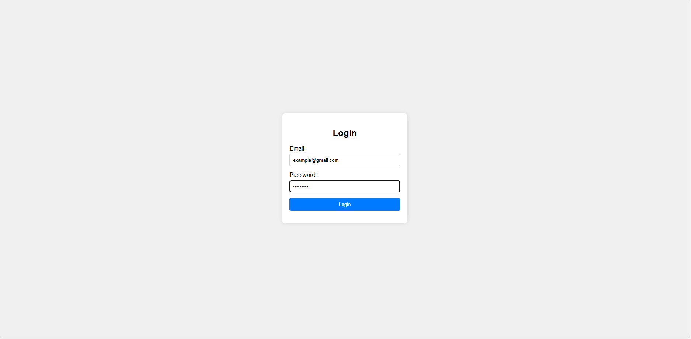
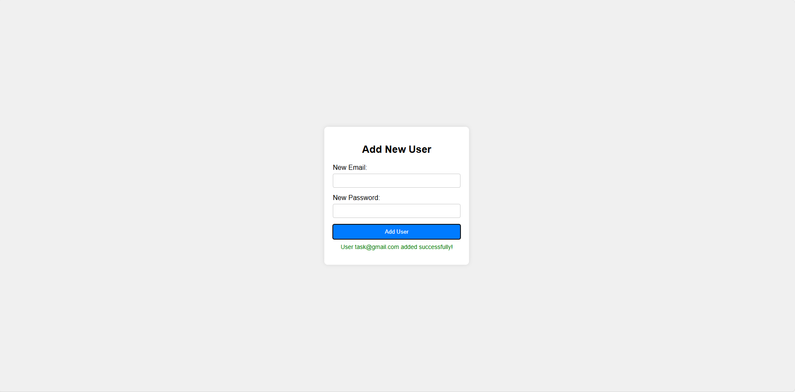

# User Authentication Form

This project implements a simple user authentication system with a login form and a user addition feature, all within a single HTML file. It includes client-side validation for email format and password length, styled with CSS, and powered by JavaScript for interactivity.

## Features
- **Login Form**: Validates email format and ensures password is at least 6 characters long. Any valid email and password combination is accepted for login.
- **Add User Form**: After successful login, users can add new users with similar validation rules.
- **Single File**: Combines HTML, CSS, and JavaScript into one portable `index.html` file.

## setup
1. **Clone the Repository**
2. **Run the Application**:
  open the html file in your browser to view the application.

## Screenshots

