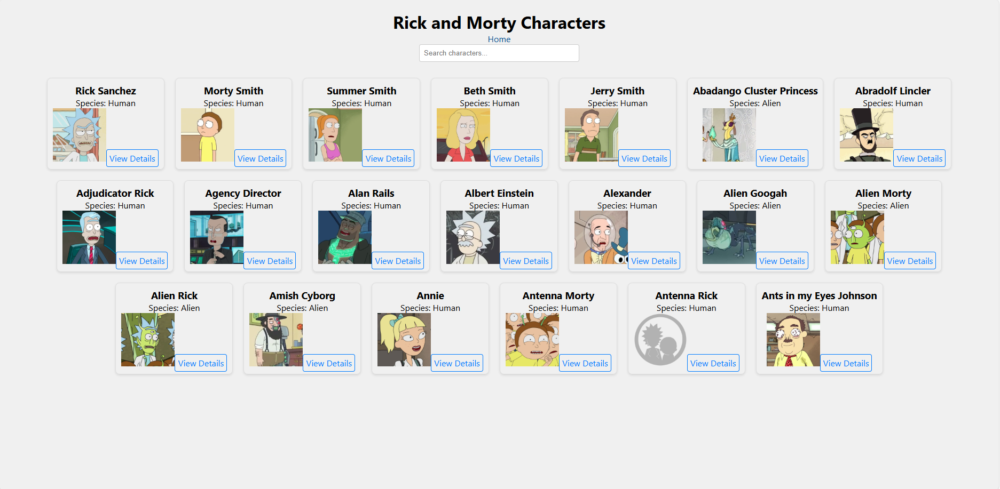
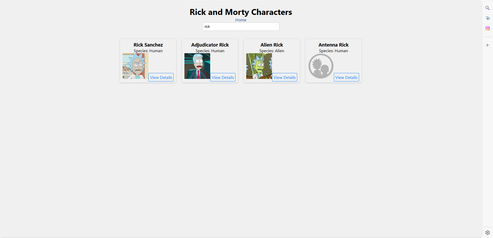
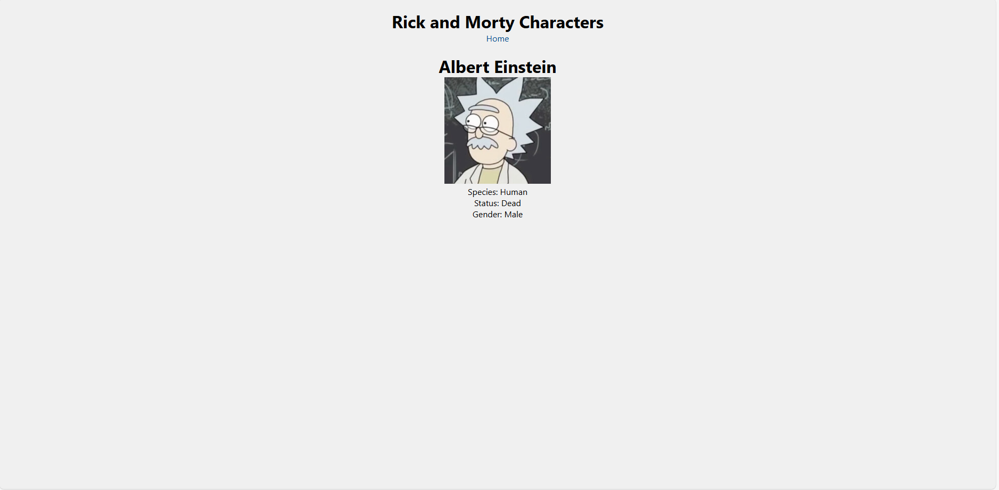

# SPA with Data Fetching

This is a Single-Page Application (SPA) built with React that fetches and displays character data from the Rick and Morty API. It includes navigation and interactive UI updates.

## Prerequisites
- Node.js and npm installed on your machine.

## Setup Instructions
1. download this repository.
2. Navigate to the project directory: in terminal 

## enter this commands to run the task in web page :-
1. npm install
2. npm start 
3. Open your web browser and navigate to http://localhost:3000/
4. You can interact with the app by clicking on the character cards to view more information.

## Screenshots

