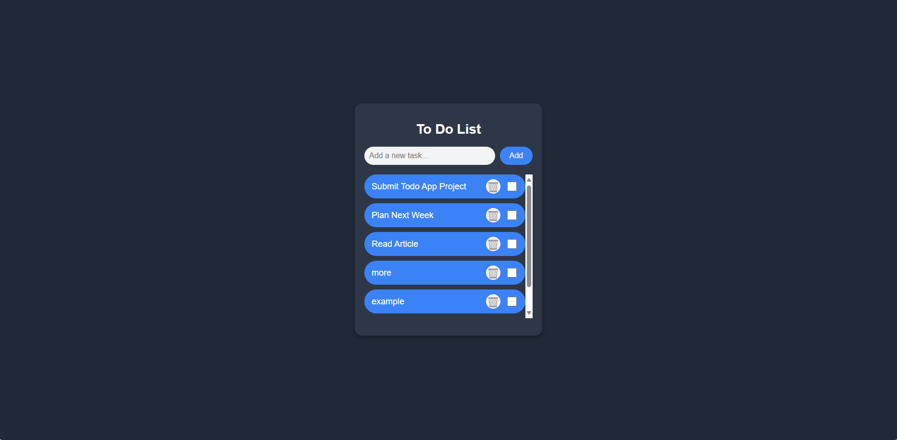
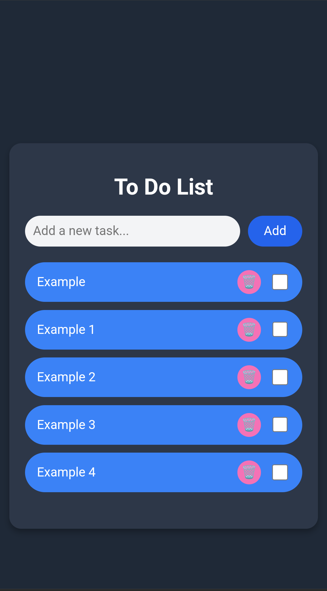

# To Do List

A responsive Todo application built with HTML, CSS, and JavaScript in a single file.

## Setup
1. Clone or download this repository.

## Execution
1. Open `index.html` in your browser.
2. Add tasks by typing in the input field and clicking the "Add" button or pressing Enter.
3. Mark tasks as complete by checking the checkbox (on the right).
4. Delete tasks by clicking the dustbin icon (🗑️) (on the right, before the checkbox).
5. Scroll to view tasks beyond the first 5.

## Features
- Responsive design for mobile and desktop.
- Task persistence using localStorage.
- Limited to 5 visible tasks with scrolling for additional tasks.
- Task text on the left, checkbox and dustbin icon on the right.

## Screenshots

